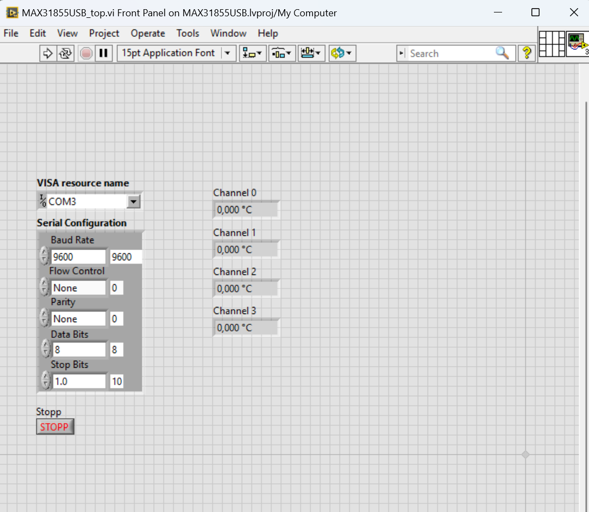

# MAX31855USB LabVIEW example

The example was created with LabVIEW 2014 SP1. 

To run the example, you need to have the [ni-serial packet](https://www.ni.com/de/support/downloads/drivers/download.ni-serial.html) installed.

To run the example, open the project file MAX31855USB.lvproj in you LabVIEW installation.
The MAX31855USB_top.vi is the main file of the demo. This file implements a little GUI, allowing the user to set the 
VISA resource name in the formant COMx. Also, it displays the read values of the thermocouple channels.
The serial configuration should be set correctly by default.

Running this demo will try to connect to the given COM port. If successful, the device will be read every second and 
the values in the display will be updated.

This demo should give you a good starting point to integrate the MAX31855USB in your project.

 