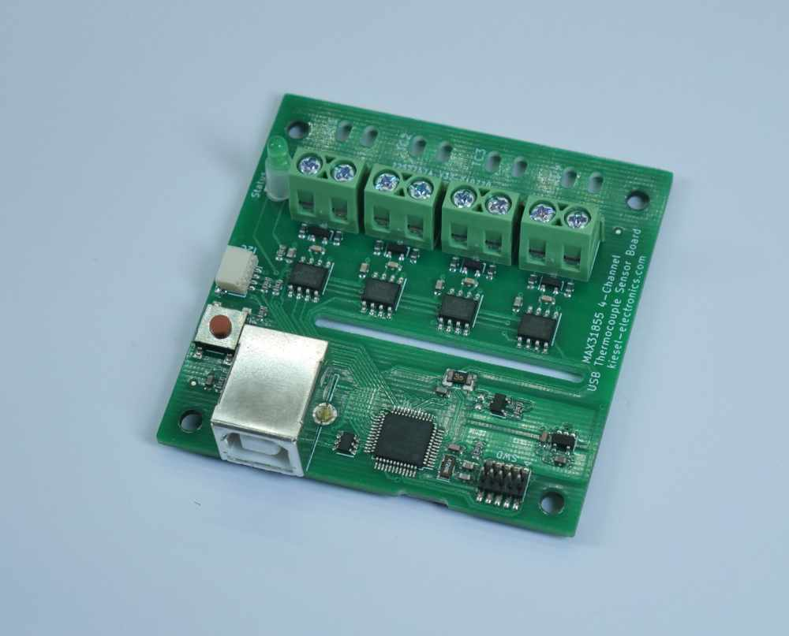
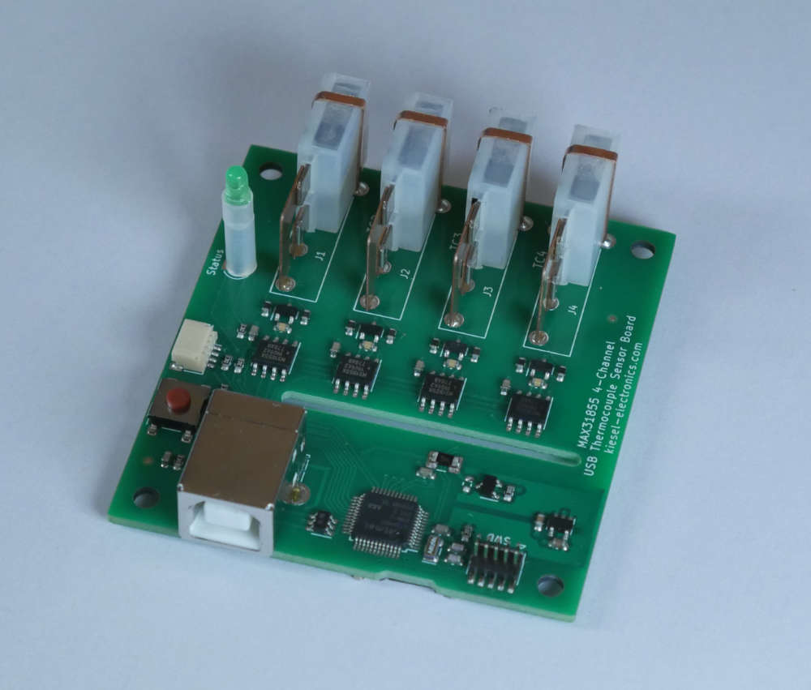
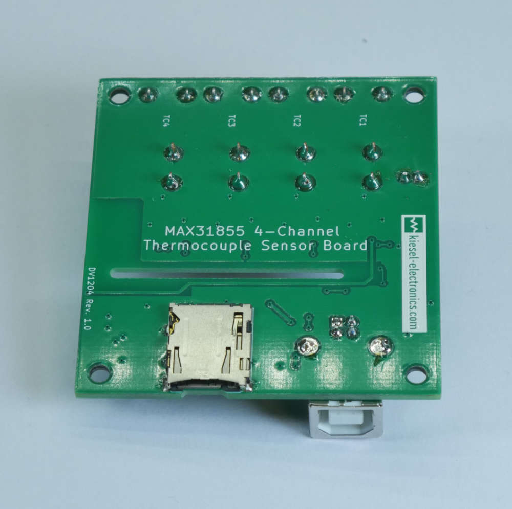

# MAX31855USB

This is the code repository for the 4 channel MAX31855 USB K-Type Thermocouple Sensor Board.
It contains the firmware code for the microcontroller as well as the python examples for reading the sensors.
The Board can either be used for data acquisition via USB using a virtual serial port or as a standalone data logger recording data onto a micro SD card.  
The Board can be extended via the available I2C port. Currently, the software supports up to 8 MCP9808 precision temperature sensors. Since this is open-source software, more devices can be supported easily.
The schematic of the board is available here: [MAX31855USB_Schematic](./MAX31855USB_Schematic.pdf)

The Board and the precision temperature sensors are available in my Tindie store:

[4CH K-Type Thermocouple USB IF and data logger](https://www.tindie.com/products/25519/)

[4CH K-Type Thermocouple USB IF and data logger Version 2](https://www.tindie.com/products/29220/)

[MCP9808 I2C precision temperature sensor](https://www.tindie.com/products/25494/)

# Data logging
Standalone data logging requires a micro USB card formatted with FAT16 or FAT32.  
The logging configuration needs to be written as config.txt directly in the root folder of the SD card.  
A template can be found in this repository: [config.txt](./config.txt)

There are three parameters in the config file.
* csv_delimiter: defines the character separating the entries
* decimal_separator: usually `.` or `,`
* logging_interval: logging interval in seconds

Write the config file to the root folder of the SD card. Insert the SD card into the slot of the board.  
Once powered up, the data logging starts when the start/stop button gets pressed.   
The LED blinks briefly each time when a new data point is recorded.  
Another button press stops the data logging.  

# USB data acquisition
The sensors can be read using SCPI style commands.  
The following commands are supported:
* `*IDN?` Returns the device id string, something like "MAX31855USB,v1.0"
* `:TEMPerature?` Returns the temperature of the connected sensors. The values are separated by `,`.
* `:TEMPerature:INTern?` Returns the internal temperature of the MAX31855 chips. The values are separated by `,`.

A python library for data acquisition and an example of how to read the sensors can be found in the python folder of this repository.

 

 
